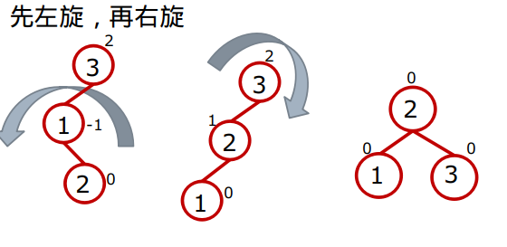
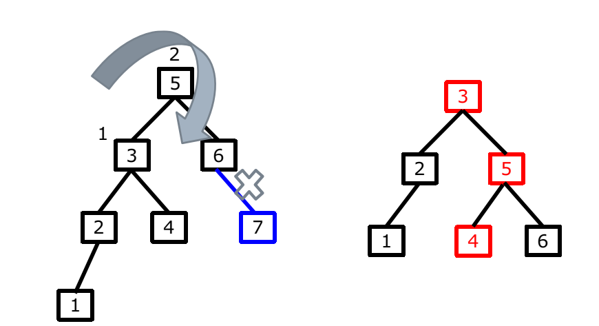
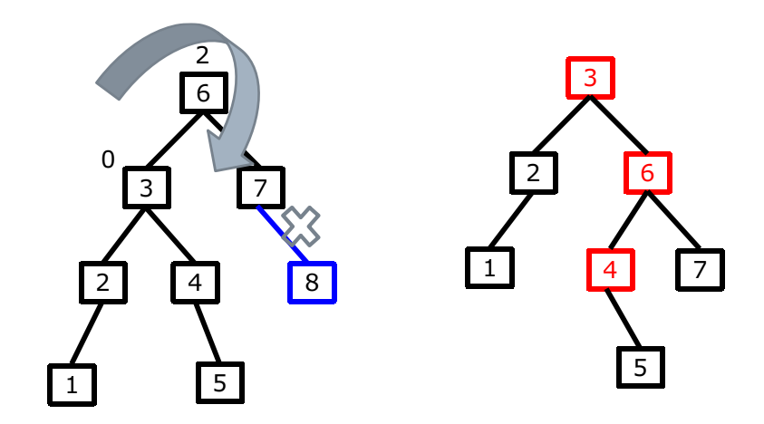
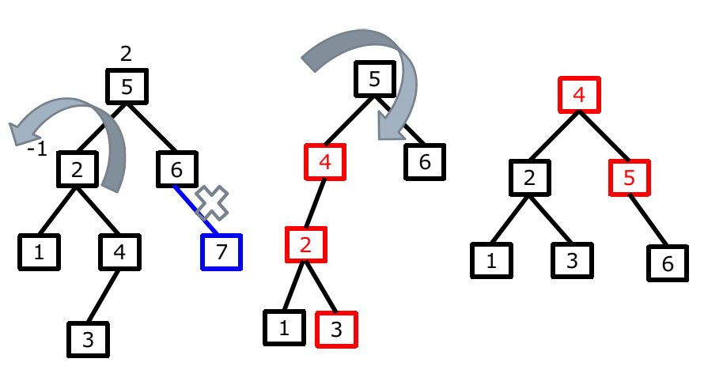
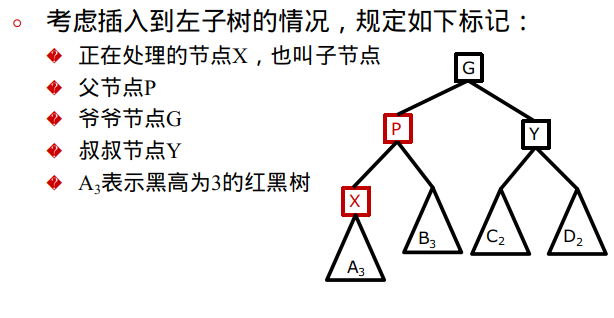
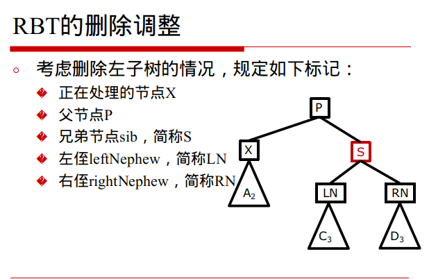

## 红黑树剖析

## BST部分

### 二叉排序树、二叉搜索树

#### 性质： 

1. 定义的空树是BST
2. 左子树所有节点的值均小于根节点的值
3. 右子树所有节点的值均大于根节点的值
4. 中序遍历序列为升序

#### 实现二插排序树：

##### 节点定义、插入

* 节点： AVLEntry
* 字典：AVLMap
  * int compara(K a, K b) 比较关键字a和b的大小
  * boolean isEmpty() 判断map是否为空
  * V put(K key, V value) 添加元素

##### 迭代器

* LeetCode173 binary search tree iterator
* 要点： 利用中序遍历
  * 方案1： 递归添加进入线性集合， 迭代线性集合
  * 方案2： 非递归， 使左路径节点压栈
* AVL迭代器
  * 属性stack ， 存储BST的节点
  * hasNext, 是否还有下一个节点
  * next 下一个节点的值
  * remove 线程安全问题
* AVLMap继承Iterable， 并重写Iterator方法， 返回AVL迭代器即可

##### 查找

###### **原理**：

1. 若是根节点的值小于key， 递归从右子树查找
2. 若是根节点的值大于key， 递归从左子树查找
3. 如是根节点等于key， 成功
4. 若是子树为空， 失败

###### **实现**

模拟TreeMap的代码结构， 实现以下方法

1. AVLEntry getEntry(K key) 私有方法 主要查找逻辑
2. boolean containsKey(K key) 是否能找到关键字
3. V get(K key) 根据关键字返回对应的value
4. boolean containsValue(V value) 能够找到value

##### 删除（重点）

###### 原理

删除操作较为繁琐， 需要考虑断链的情况，以及删除之后， 还需满足BST的特性

共分为三种情况， 假设删除的节点为p， 父节点为f

1. p为叶子节点， 直接删除
2. p的左子树（右子树）不为空，删除之后， 其左子树（右子树）填补p的空缺位置
3. p既有左子树又有右子树， 找到右子树的最小值节点M（左子树的最大值）将该值替换p的值，之后按照1、2两种情况删除M即可

###### 实现

1. AVLEntry<K, V> deleteEntry()  递归函数（主逻辑）

2. V remote(K key) 删除关键字key 返回对应的value

3. void levelOrder 辅助函数 层次遍历

   用于输出观察

**面试经典：**

寻找最大最小节点

BST的前驱和


 ##### BST的前驱和后继节点

前驱结点：节点val值小于该节点val值并且值最大的节点 

后继节点：节点val值大于该节点val值并且值最小的节点

###### **前驱节点**（有父指针的情况）

1. 若一个节点有左子树，那么该节点的前驱节点是其左子树中val值最大的节点（也就是左子树中所谓的rightMostNode）
2. 若一个节点没有左子树，那么判断该节点和其父节点的关系 
   2.1 若该节点是其父节点的右边孩子，那么该节点的前驱结点即为其父节点。 
   2.2 若该节点是其父节点的左边孩子，那么需要沿着其父亲节点一直向树的顶端寻找，直到找到一个节点P，P节点是其父节点Q的右边孩子，那么Q就是该节点的后继节点

###### **后继节点**（有父指针的情况）

1. 若一个节点有右子树，那么该节点的后继节点是其右子树中val值最小的节点（也就是右子树中所谓的leftMostNode）
2. 若一个节点没有右子树，那么判断该节点和其父节点的关系 
   2.1 若该节点是其父节点的左边孩子，那么该节点的后继结点即为其父节点 
   2.2 若该节点是其父节点的右边孩子，那么需要沿着其父亲节点一直向树的顶端寻找，直到找到一个节点P，P节点是其父节点Q的左边孩子，那么Q就是该节点的后继节点

###### LIntCode 448 Inorder Successor in BST

1. p为最大节点， 返回null

2. p有右子树

3. p没有右子树

   1. 进行二叉查找， 并压栈， 之后弹栈

   

## AVL 

#### 定义

BST和TreeMap的效率对比

|         情况         | BST  | TreeMap |
| :------------------: | :--: | :-----: |
| 升序序列（降序序列） | Slow |   OK    |
|       随机序列       |  OK  |   OK    |

AVL是一种自平衡的二叉树

1. BST
2. 左右子树的高度差绝对值<1
3. 空树、左右子树都是AVL

#### 旋转与插入

##### 旋转

1. 右旋

   1. 右旋

      

   2. 先左旋再右旋

      

2. 左旋

   同理 

3. 什么时候需要旋转

   插入关键字key后，节点p的平衡因子由原来的1或者-1，变成了2或者-2，则需要旋转；只考虑插入key到左子树left的情形，即**平衡因子为2**

   1. 情况1：key<left.key, 即插入到left的左子树，需要进行单旋转，将节点p右旋
   2. 情况2：key>left.key, 即插入到left的右子树，需要进行双旋转，先将left左旋，再将p右旋
      插入到右子树right

   **平衡因子为-2**，完全对称

对于检测是否平衡并旋转的调整过程**自顶向下OR自底向上**

1. 对于BST的插入， 是自顶向下的，AVL的插入和BST的插入是一样的也是自顶向下
2. 在检测节点p是否平衡之前，必须先保证左右子树已经平衡
3. 子问题成立 ---> 总问题成立 ： ==自底向上==
4. 有parent指针， 直接向上回溯
5. 无parent指针， 后续遍历、递归
6. 无parent指针， 栈实现非递归

**LeetCode110. Balanced Binary Tree**

##### 插入

##### 代码实现

1. AVLEnrty增加height属性，表示树的高度 ==> 平衡因子可以实时计算
2. 单旋转：右旋rotateRight、左旋rotateLeft
3. 双旋转：先左后右firstLeftThenRight、先右后左firstRightThenLeft
4. 辅助栈stack，将插入时候所经过的路径压栈
5. 插入调整函数fixAfterInsertion
6. 辅助函数checkBalance，断言AVL树的平衡性，检测算法的正确性

##### 算法改进&&时间复杂度分析

弹栈的时候，一旦发现某个节点并未改变，则停止弹栈

指针回溯次数：最坏为O(logN)最好为O(log1) , 平均为O(logN)

旋转次数： 无需旋转、单旋转、双旋转、不会超过两次

时间复杂度： BST插入O(logN)+指针回溯O(logN) + 旋转O(1) = O(logN)

空间复杂度： 有parent指针为O(1) 无parent指针为O(logN) 

#### 面试经典：排序数组转化为AVL和RBT

treeMap中buildFromSorted实现功能类似

#### 删除

##### 原理

类似插入，假设删除了p右子树的某个节点，引起了p的平衡因子d[p]=2，分析p的左子树left，三种情况如下：

1. left的平衡因子d[left]=1，将p右旋

   

2. left的平衡因子d[left]=0，将p右旋

   

3. left的平衡因子d[left]= -1，先左旋left，再右旋p

   

删除左子树，即d[p]= -2的情形，与d[p]=2对称

##### 实现

1. fixAfterDeletion：调整某个节点p
2. deleteEntry直接调用fixAfterDeletion


## 红黑树

### 红黑树定义

1. 任意节点要么是红色，要么是黑色
2. 根节点为黑色
3. 所有的叶子节点为黑色（叶子节点为空）
4. 如果一个节点为红色，那么它的两个子节点都为黑色
5. 任意节点从它出发， 到所有叶子节点的路径上包含相同数量的黑色节点
   1. 简称为黑高（BlackHeight、BH）

##### 由此衍生出的性质：

1. 任意一颗以黑色节点为根的子树也必定是一颗红黑树
2. 左（右）子树的高度最多是右（左）子树的两倍
3. 其必定是一个BST

红黑树在JDK源码中的实现(TreeMap中的**fixAfterInsertion**和**fixAfterDeletion**)：

### 插入操作

==自底向上==

RBT中的插入调整： fixAfterInsersion: cast1、case2、case3

RBT中的删除调整：fixAfterDeletion: case1、case2、case3、case4

#### 插入原则

1. 若插入的为黑色的节点，违法性质5
2. 只能插入红色节点，可能违反性质4，继续调整



####  插入正确性证明

1. 是否会引起左右子树的BH不一致
2. 有无继续破坏性质4的可能


#### 插入调整

**无需调整的情况为：**

1. X为根节点，将X由红染黑，简称rootOver

2. 父节点P为黑色，BlackParentOver，简称bpOver

```java
while (x != null && x != root && x.parent.color == RED) 
```

**需要调整的情况为：**

仅仅需要考虑父节点P为红色的情形，由于性质4，爷爷节点G必定为黑色，分为三种情况：
case1: Y为红色，X可左可右；P、Y染黑，G染红，X回溯至G
case2: Y为黑色，X为右孩子；左旋P，X指向P，转化为case3
case3: Y为黑色，X为左孩子；P染黑，G染红，右旋G，结束
结论：RBT的插入调整最多旋转2次 

##### case1

1. 条件P为红色，为G的左孩子， Y为红色， X可左可右，
2. 处理方式： 将P、Y染黑， G然为红色，X回溯至G即可
3. 条件简称： 红左父、红叔、红左右子
4. 处理方式简称： 父叔变黑、爷变红，子变爷

```java
if (parentOf(x) == leftOf(parentOf(parentOf(x)))) {
	Entry<K,V> y = rightOf(parentOf(parentOf(x)));
    if (colorOf(y) == RED) {
    	setColor(parentOf(x), BLACK);
        setColor(y, BLACK);
        setColor(parentOf(parentOf(x)), RED);
        x = parentOf(parentOf(x));
	}
}
```

##### case2

1. 条件： P为G的左孩子，Y为黑色，X为右孩子
2. 处理方式：左旋P，X指向P，转化为case3
3. 条件简称：红左父，黑叔，红右子
4. 处理方式简称：左旋父、子变父、变为case3 

```java
else {
  if (x == rightOf(parentOf(x))) { 
      x = parentOf(x); // X指向P
      rotateLeft(x); // 左旋P
  }
```

##### case3

1. 条件：P为G的左孩子，Y为黑色，X为左孩子
2. 处理方式：P染黑，G染红，右旋G，结束
3. 条件简称：红左父，黑叔，红左子
4. 处理方式简称：父变黑、爷变红、右旋爷

```java
setColor(parentOf(x), BLACK); // P染黑
setColor(parentOf(parentOf(x)), RED); // G 染红
rotateRight(parentOf(parentOf(x))); // 右旋G
```

当P为G的右孩子，同理

rightCase1：Y为红，X可左可右；P、Y变黑，G变红，X变G
rightCase2：Y为黑，X为左孩子；右旋P，X变P，转case3
rightCase3：Y为黑，X为右孩子；G变红，P变黑，左旋G

### 删除操作

二插排序树的删除： 三种情况

AVL树的删除：两种情况

红黑树的删除： 四种情况

#### 删除原则

1. 删除的节点为红色，则直接删除，并不影响整体结果，需要注意防止断链
2. 删除的节点为黑色，所在的BH--，需要进行调整

#### 删除调整



#### 删除正确性证明

1. 是否违反性质五
   1. X的BH只能保持或者不变，否者X要比S的BH要小
2. 是否违反性质四
   1. 若谷违反了，继续染黑还是回溯


#### 删除调整

**无需调整的情况**

当前X为根节点，无论root为什么颜色，都将root染黑， rootOver

当前X为红色， 将X染黑， redOver

```java
while (x != root && colorOf(x) == BLACK)
```

##### 删除左孩子X 四种情况

###### case1

**条件**：S为红色
**隐含条件**：由于性质4，P、LN、RN必定都为黑色
**处理方式：**S染黑，P染红，左旋P，LN成为新的sib

```java
if (x == leftOf(parentOf(x))) {
    Entry<K,V> sib = rightOf(parentOf(x));
    if (colorOf(sib) == RED) {
        setColor(sib, BLACK);
        setColor(parentOf(x), RED);
        rotateLeft(parentOf(x));
        sib = rightOf(parentOf(x));
    }
```


###### case2

**条件；**

case2-1条件：S、LN、RN均为黑色，P为黑色

case2-2条件：S、LN、RN均为黑色，P为红色

**隐含条件**：由于性质4，P、LN、RN必定都为黑色
**处理方式**：S染黑，P染红，左旋P，LN成为新的sib
**处理方式相同**：S染红，X回溯至P


###### case3

**条件：**S为黑色，LN为红色，RN为黑色
**处理方式：**LN染黑、S染红，右旋S，S指向LN
转化为case4-1、case4-2


###### case4

S为黑色，LN随意，红RN；S变P的颜色，P和S染黑，左旋P


## Comparable和Comparator

#### Comparable

##### Comparable简介

**Comparable是排序接口。**

若一个类实现了Comparable接口，就意味着“**该类支持排序**”。  即然实现Comparable接口的类支持排序，假设现在存在“实现Comparable接口的类的对象的List列表(或数组)”，则该List列表(或数组)可以通过 Collections.sort（或 Arrays.sort）进行排序。

此外，“实现Comparable接口的类的对象”可以用作“有序映射(如TreeMap)”中的键或“有序集合(TreeSet)”中的元素，而不需要指定比较器。

##### Comparable 定义

Comparable 接口仅仅只包括一个函数，它的定义如下：

```java
package java.lang;
import java.util.*;

public interface Comparable<T> {
    public int compareTo(T o);
}
```

假设我们通过 x.compareTo(y) 来“比较x和y的大小”。若返回“负数”，意味着“x比y小”；返回“零”，意味着“x等于y”；返回“正数”，意味着“x大于y”。

#### Comparator

##### Comparator简介

**Comparator 是比较器接口。**

我们若需要控制某个类的次序，而该类本身不支持排序(即没有实现Comparable接口)；那么，我们可以建立一个“该类的比较器”来进行排序。这个“比较器”只需要实现Comparator接口即可。

也就是说，我们可以通过“**实现Comparator类来新建一个比较器**”，然后通过该比较器对类进行排序。

##### Comparator定义

Comparator 接口仅仅只包括两个个函数，它的定义如下：

```java
package java.util;

public interface Comparator<T> {

    int compare(T o1, T o2);

    boolean equals(Object obj);
}
```


#### 总结

##### 相同

- Comparable和Comparator都是用来实现对象的比较、排序
- 要想对象比较、排序，都需要实现Comparable或Comparator接口
- Comparable和Comparator都是Java的接口

##### 区别

- Comparator位于java.util包下，而Comparable位于java.lang包下
- Comparable接口的实现是在类的内部（如 String、Integer已经实现了Comparable接口，自己就可以完成比较大小操作），Comparator接口的实现是在类的外部（可以理解为一个是自已完成比较，一个是外部程序实现比较）
- 实现Comparable接口要重写compareTo方法, 在compareTo方法里面实现比较


